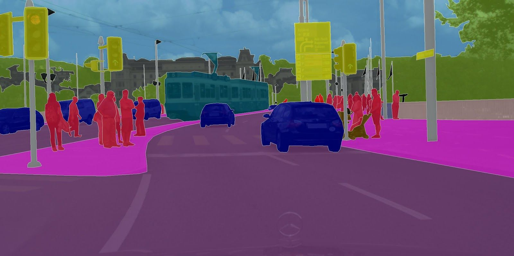
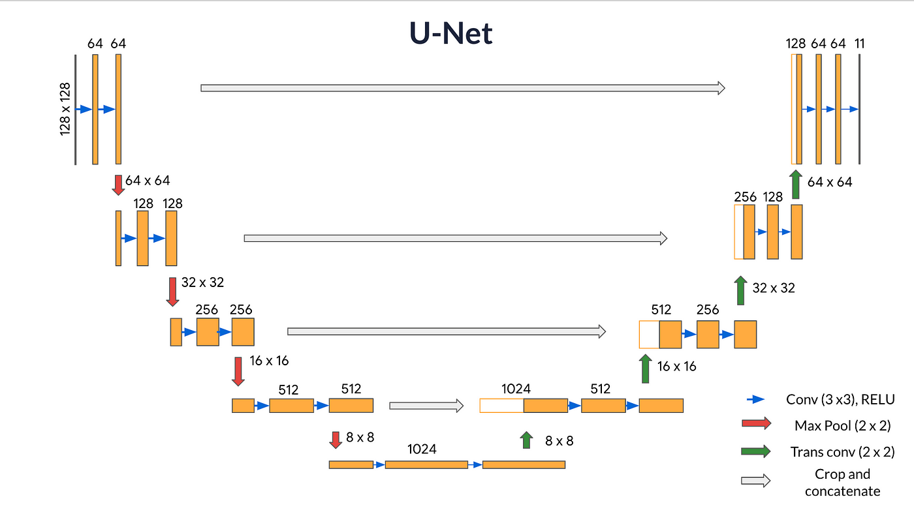
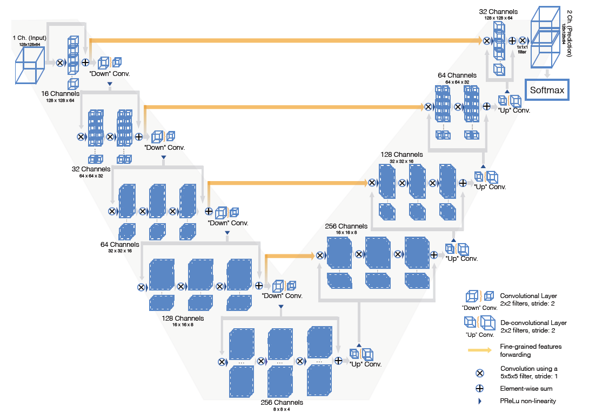
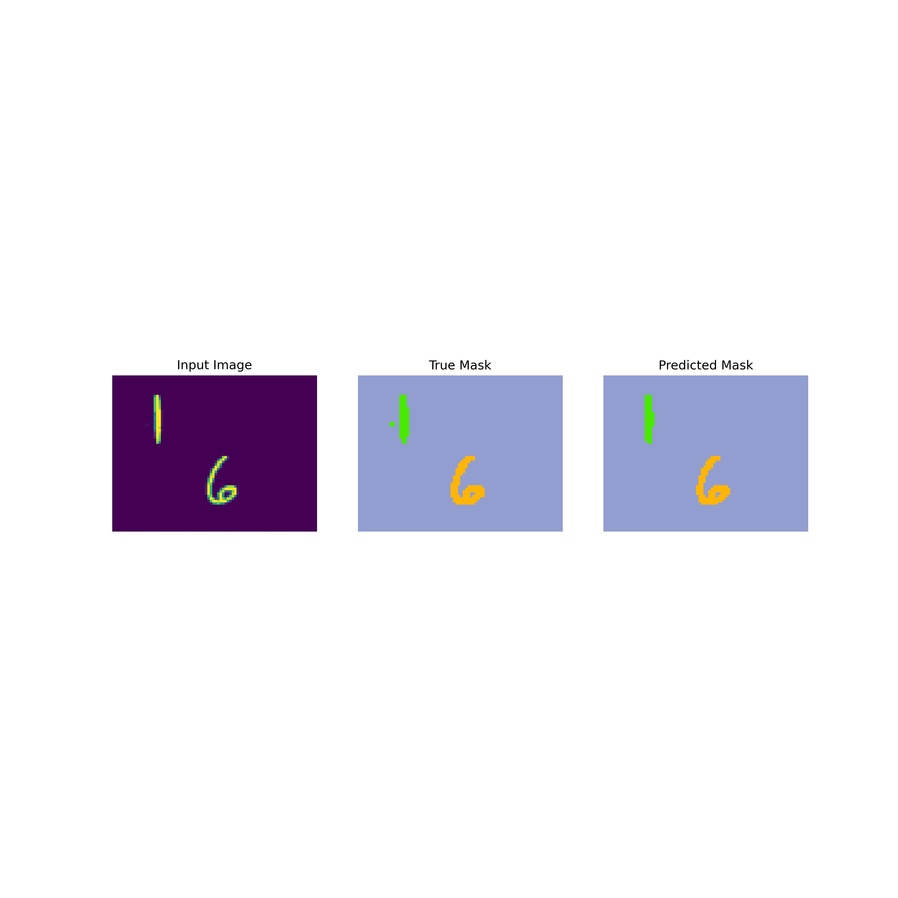

# Overview
In this project, I aim to implement U-Net and V-Net (a 2D version actually) to perform semantic segmentation on the M2NIST dataset.

[M2NIST](https://www.kaggle.com/datasets/farhanhubble/multimnistm2nist) is a multi-digit version of the MNIST dataset which has segmentation masks for each image. It is a relatively simple dataset for semantic segmentation tasks, making it easy and fast to train on.

In the following sections, I will briefly explain the main ideas and present the results of each model in the assigned task.

# Semantic Segmentation
Semantic segmentation is a computer vision task that involves classifying each pixel in an image into a specific category or class. This task goes beyond object detection, which only identifies the presence of objects in an image without specifying their exact boundaries. In semantic segmentation, the goal is to label each pixel with a class label (e.g., person, car, road, sky) to provide a detailed understanding of the image's content. This technique is widely used in various fields such as autonomous driving, medical imaging, and satellite imagery analysis. By segmenting an image semantically, computers can better understand the visual world and make more informed decisions based on the pixel-wise annotations.

|  | 
|:--:| 
| *Semantic Segmentation* |
*source : [Nanonets](https://www.google.com/url?sa=i&url=https%3A%2F%2Fnanonets.com%2Fblog%2Fsemantic-image-segmentation-2020%2F&psig=AOvVaw2nq_S2KglaqVXqMC6QOHWL&ust=1708576854268000&source=images&cd=vfe&opi=89978449&ved=0CBMQjRxqFwoTCOiUgvbOu4QDFQAAAAAdAAAAABAE)*

# Fully Convolutional Network
Convolutional Neural Networks (CNNs) traditionally excel in tasks like image classification by leveraging convolutional and pooling layers to extract features and make predictions. When it comes to semantic segmentation, Fully Convolutional Networks (FCNs) adapt the CNN architecture by removing the fully connected layers. FCNs maintain spatial information throughout the network, allowing input images of varying sizes to produce output segmentation maps of the same dimensions.

In the encoding stage, FCNs extract high-level features through convolutional and pooling layers, gradually reducing spatial dimensions. The decoding stage involves upsampling the spatial dimensions back to the original image size using transposed convolutions or upsampling layers. Through decoding, FCNs combine low-level features from encoding with high-level features, often through skip connections, to enhance segmentation accuracy. This process enables FCNs to perform pixel-wise predictions for semantic segmentation effectively.

|  | 
|:--:| 
| *FCN 8* |
*source : [GreatLearning](https://www.google.com/url?sa=i&url=https%3A%2F%2Fwww.mygreatlearning.com%2Fblog%2Ffcn-fully-convolutional-network-semantic-segmentation%2F&psig=AOvVaw0H42f57eMcbHEWUbggWhoF&ust=1708579247928000&source=images&cd=vfe&opi=89978449&ved=0CBMQjRxqFwoTCNDesO7Xu4QDFQAAAAAdAAAAABAE)*

# U-Net
U-Net is an architecture designed for biomedical image segmentation tasks but widely used in various image segmentation applications due to its effectiveness. U-Net improves upon the basic FCN architecture by introducing skip connections that directly connect encoding layers to corresponding decoding layers at the same spatial resolution. These skip connections aid in preserving fine-grained details during upsampling and help avoid information loss in the decoding process.

By incorporating skip connections that directly link feature maps from encoding stages to corresponding decoding stages, U-Net encourages the efficient fusion of high-level semantic information with detailed spatial information. This strategy enables the network to access features at multiple levels of abstraction during the upsampling process, aiding in the reconstruction of intricate spatial structures and enhancing segmentation accuracy.

The symmetrical design of the U-Net architecture ensures that the lengths of the downsampling and upsampling paths match, promoting a balance between feature extraction and resolution refinement. This symmetry facilitates the seamless integration of skip connections, allowing extracted features from different scales to be effectively combined and propagated across the network for more robust segmentation performance.

|  | 
|:--:| 
| *U-Net* |
*source : [Medium](https://www.google.com/url?sa=i&url=https%3A%2F%2Flukmanaj.medium.com%2Fu-net-architecture-revolutionizing-computer-vision-through-innovative-image-segmentation-e1e2155c38b1&psig=AOvVaw3_sP1q-PTTwuApImsbYL7f&ust=1708579770169000&source=images&cd=vfe&opi=89978449&ved=0CBMQjRxqFwoTCODJ2uXZu4QDFQAAAAAdAAAAABAQ)*

# V-Net
This architecture closely follows the principles of U-Net by incorporating two symmetric contracting and expanding paths. However, V-Net distinguishes itself by adopting a fully-convolutional structure, exclusively employing convolution operations while eliminating pooling layers.

The decision to forgo pooling layers in V-Net serves two primary purposes. Firstly, pooling operations can be replaced efficiently with convolutions of larger strides, resulting in networks that are quicker to train. Additionally, utilizing deconvolutions for upsampling in the expanding path is more straightforward compared to unpooled layers, facilitating easier comprehension and analysis.

One notable departure between U-Net and V-Net is the choice of training methodology. While U-Net typically utilizes stochastic gradient descent, V-Net leverages residual connections to expedite convergence and enhance segmentation outcomes.

By incorporating residual connections, V-Net enhances the flow of gradients during training, mitigating issues related to vanishing gradients and enabling faster convergence. This approach allows the model to learn more effectively and efficiently, improving segmentation accuracy.

The elimination of pooling layers in V-Net reduces memory overhead and helps maintain spatial information throughout the network. This absence of pooling layers also enhances the model's ability to extract robust features and preserves finer details in the segmentation process.

|  | 
|:--:| 
| *V-Net* |
*source : [Towards Data Science](https://www.google.com/url?sa=i&url=https%3A%2F%2Ftowardsdatascience.com%2Freview-v-net-volumetric-convolution-biomedical-image-segmentation-aa15dbaea974&psig=AOvVaw3B_lGotPgHdbwdb9tYMOya&ust=1708580996516000&source=images&cd=vfe&opi=89978449&ved=0CBMQjRxqFwoTCKj1mK3eu4QDFQAAAAAdAAAAABAE)*

# Results
Firstly, I would like to mention that I have implemented the V-Net for 2D images and incorporated innovative ideas from the V-Net to enhance the architecture of the U-Net. Hence, there is potential for enhancing the architecture further.

Before delving into the comparison of results, let me provide a brief overview of my approach. In the downsampling block, I substituted the pooling layer with a simple conv2d layer having a stride of 2. To incorporate residual activation into the convolution layer outputs, an increase in the number of channels was necessary. Consequently, I utilized a 1x1 convolution layer. This layer is activated linearly, which I deem the optimal choice for the following reasons:

The use of linear activation (or no activation) in the 1x1 convolution prevents the introduction of nonlinearities to the transformation. This characteristic enables the layer to function as a straightforward feature mapping tool without substantially altering the input distribution. Consequently, the layer primarily concentrates on adjusting the channel dimensionality while retaining information from the preceding layer. This strategy facilitates the preservation of the input identity while concurrently acquiring additional representations. As a result, the model learns to bypass the input of the 1x1 conv after sufficient iterations. In the upsampling block, I employed transposed convolutions to upscale the output of the previous layer. Additionally, a residual connection was incorporated into this block. The remaining implementation details remained consistent.

Both models performed well on the dataset. Increasing the number of iterations appeared to significantly reduce the loss. To ensure a fair comparison, I aimed to achieve a similar validation loss for both models. The V-Net demonstrated superior accuracy in capturing spatial patterns. For example, in a test image, the V-Net excelled in outlining the boundaries of a digit 1.

|  |  |
|:--:|:--:|
| *V-Net output* | *U-Net output* |

| class | V-Net IoU | U-Net IoU | V-Net Dice score | U-Net Dice score|
| ----- | ---- | ---- | ----- | ---- |
| 0 | 0.9457 | 0.9253 | 0.9670 | 0.9684 |
| 1 | 0.9478 | 0.9259 | 0.9646 | 0.9774 |
| 2 | 0.9413 | 0.9475 | 0.9670 | 0.9700 |
| 3 | 0.9208 | 0.9338 | 0.9504 | 0.9658 |
| 4 | 0.9122 | 0.9282 | 0.9389 | 0.9653 |
| 5 | 0.9421 | 0.9345 | 0.9686 | 0.9617 |
| 6 | 0.9511 | 0.9444 | 0.9738 | 0.9762 |
| 7 | 0.9506 | 0.9082 | 0.9719 | 0.9460 |
| 8 | 0.9348 | 0.9419 | 0.9562 | 0.9733 |
| 9 | 0.9175 | 0.8846 | 0.9461 | 0.9390 |
| 10 | 0.9975 | 0.9973 | 0.9987 | 0.9987 |

The results indicate that V-Net better captures the spatial relationships and boundaries within these classes.

